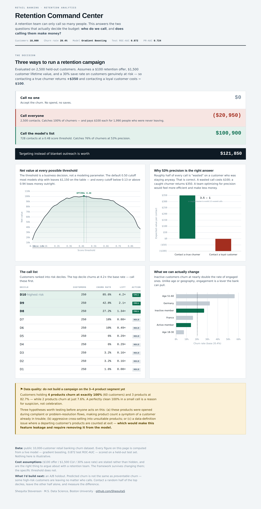

# Retention Command Center — Retail Banking Churn

**Shequita Stevenson** | Python (pandas, scikit-learn) · SQL · Chart.js · Tableau/Power BI

An executive dashboard for a bank's retention team. Every number on it is
computed from a live model on real data — nothing is illustrative.

**[→ View the live dashboard](https://shequitas.github.io/Executive-KPI-Dashboard/)**



---

## The question it answers

A retention team can only call so many people. Most executive dashboards lead
with a big revenue number. This one leads with a **decision**:

> **Who do we call, and does calling them make money?**

| Strategy | Net value |
|---|---|
| Call no one | $0 |
| **Call everyone** | **($20,950)** |
| **Call the model's list** (728 of 2,500) | **$100,900** |

**Blanket outreach loses money.** It catches every churner — and pays $100 each
for 1,990 customers who were never leaving. Targeting instead of blanketing is
worth **$121,850** on a 2,500-customer test set.

---

## What's on it

**1. Net value at every possible threshold.** The threshold is a business
decision, not a modeling parameter. The default 0.50 cutoff most models ship
with leaves $1,150 on the table, and any cutoff below 0.13 or above 0.94 loses
money outright.

**2. Why 53% precision is the right answer.** At the optimal threshold, roughly
half of every call is "wasted" on a customer who was staying anyway. That is
correct: a wasted call costs $100, a caught churner returns $350. **A team
optimizing for precision would feel more efficient and make less money.**

**3. The call list.** Customers ranked into risk deciles. The top decile churns
at **85.6% — 4.2× the base rate.** The top three deciles are flagged *Call*.

**4. What we can actually change.** Inactive customers churn at nearly double
the rate of engaged ones. Unlike age or geography, engagement is a lever the
bank can pull — so it's coloured differently from the drivers that aren't
addressable.

**5. A data-quality flag.** Customers holding 4 products churn at *exactly*
100% (n=60). A perfectly clean 100% in a small cell is a reason for suspicion,
not celebration — the dashboard says so, and recommends investigating leakage
before anyone builds a campaign on it.

---

## Model

| | |
|---|---|
| Dataset | Public 10,000-customer retail banking churn dataset |
| Churn rate | 20.4% |
| Model | Gradient Boosting (beat Logistic Regression at 0.787) |
| **Test ROC-AUC** | **0.872** |
| **Test PR-AUC** | **0.724** (baseline 0.204) |
| Evaluation | 2,500-customer held-out test set |

Cost assumptions — **$100 offer / $1,500 CLV / 30% save rate** — are stated on
the page rather than buried. They are the right thing to argue about with a
retention team. The framework survives changing them; the specific threshold
does not.

---

## Stack

- **Python** (pandas, scikit-learn) — model and economics, in
  [the churn project](https://github.com/ShequitaS/customer-churn-retention)
- **Chart.js** — visualizations, vendored locally (no CDN dependency)
- **HTML/CSS/JS** — single file, no build step

## Run it

```
git clone https://github.com/ShequitaS/Executive-KPI-Dashboard.git
cd Executive-KPI-Dashboard
open index.html
```

No build step, no dependencies to install. Chart.js is vendored.

## Files

```
index.html        the dashboard
chart.umd.js      Chart.js 4.4.1 (vendored)
data_inline.js    model output — deciles, threshold economics, segment churn rates
preview.png       screenshot
```

`data_inline.js` is generated from the churn model, not hand-written.

---

## What I'd build next

An **A/B holdout.** Predicted churn is not the same as *preventable* churn —
some high-risk customers are leaving no matter who calls them. Contact a random
half of the top deciles, leave the other half alone, and measure the difference.
Until that runs, the $100,900 is a modelled figure, not a measured one.
