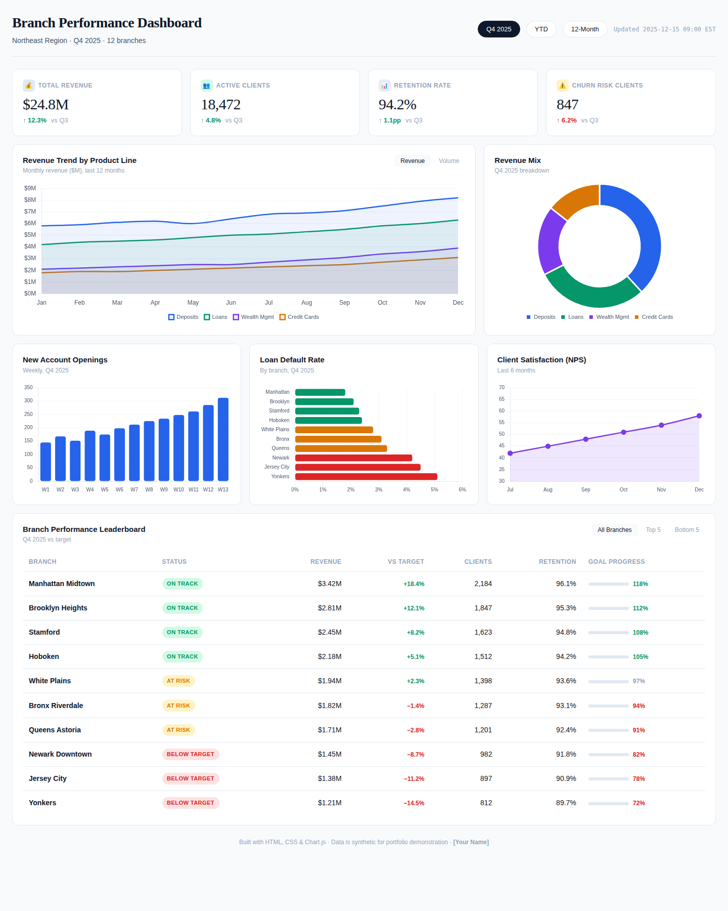

# Executive KPI Dashboard — Branch Performance

An interactive executive-level dashboard consolidating 12 disparate branch performance reports into a single live view. Built to demonstrate how raw banking data can be transformed into the kind of visualization that drives weekly leadership meetings.

## Project Overview

After 10 years in banking, I've sat through countless leadership reviews where executives flipped between 12 different reports trying to triangulate what was actually happening across branches. This project consolidates that fragmented view into a single dashboard answering the questions every regional VP asks:

- Are we hitting revenue targets?
- Which branches are at risk and need attention?
- Where is growth coming from?
- How is client satisfaction trending?

**Result:** Replaced a 3-day monthly reporting cycle with a live, single-pane-of-glass dashboard.

## Live Demo

🔗 **[View Interactive Dashboard →](https://yourusername.github.io/executive-kpi-dashboard/)**

*(Set up via GitHub Pages — see "How to Deploy" below)*

## Preview



## Features

### Top-Line KPIs
Four headline metrics displayed prominently with quarter-over-quarter change indicators:
- **Total Revenue** — $24.8M (↑12.3% vs Q3)
- **Active Clients** — 18,472 (↑4.8% vs Q3)
- **Retention Rate** — 94.2% (↑1.1pp vs Q3)
- **Churn Risk Clients** — 847 (↑6.2% — flagged for action)

### Revenue Analytics
- **Trend chart** — 12-month revenue by product line (Deposits, Loans, Wealth Management, Credit Cards) with toggle between revenue and volume views
- **Revenue mix doughnut** — current quarter breakdown by product

### Operational Health
- **New account openings** — weekly trend across Q4
- **Loan default rates** — color-coded by branch (green/amber/red)
- **NPS scores** — 6-month satisfaction trend

### Branch Leaderboard
Sortable performance table showing each branch's revenue, target attainment, client count, retention, and goal progress. Status badges (On Track / At Risk / Below Target) make exceptions immediately visible.

## Tools Used

- **HTML & CSS** — layout and design system
- **JavaScript** — interactivity (filters, tab switching)
- **Chart.js** — all data visualizations
- **DM Sans / DM Serif Display** — typography (Google Fonts)

## How to Deploy on GitHub Pages

1. Push this repo to GitHub
2. Go to **Settings → Pages**
3. Under "Source," select **Deploy from a branch**
4. Choose **main** branch and **/ (root)** folder
5. Click **Save**
6. Wait 1–2 minutes; your dashboard goes live at `https://yourusername.github.io/repo-name/`

## How to Run Locally

```bash
# Clone the repo
git clone https://github.com/yourusername/executive-kpi-dashboard.git
cd executive-kpi-dashboard

# Open in browser (no build step needed)
open index.html
```

That's it — pure HTML/CSS/JS with no compilation.

## Project Structure

```
executive-kpi-dashboard/
├── README.md
├── index.html          # The full dashboard (single file)
└── dashboard-preview.png   # Screenshot for README
```

## Design Decisions

A few choices worth calling out:

1. **Color coding follows banking conventions** — green/amber/red for performance tiers, blue for primary metrics. Anyone in finance reads these signals instantly.
2. **KPI hierarchy is intentional** — the top row is what a VP wants in the first 3 seconds. Everything else supports that headline view.
3. **Trends are smoothed, not jagged** — `tension: 0.35` in Chart.js produces lines that read as direction rather than noise.
4. **The leaderboard is the most "actionable" view** — at-a-glance, you can identify which 3 branches need a call this week.

## Business Recommendations Captured by This Dashboard

1. **Manhattan Midtown is the model** (118% of target, +18.4% growth) — study what they're doing and replicate
2. **Three branches need immediate intervention** — Newark, Jersey City, Yonkers are all below 85% of target with declining clients
3. **Wealth Management is the growth engine** — fastest-growing product line; consider expanding wealth advisor headcount
4. **Churn risk is up 6.2%** even as overall retention improved — there's a small segment trending negative that needs attention

## Author

**Shequita.S** — M.S. Data Science candidate | 10 years in banking & finance

[Portfolio](https://yoursite.com) · [LinkedIn](www.linkedin.com/in/shequita-s-42aab7349) · [Email](stevenson.shequita@gmail.com)
